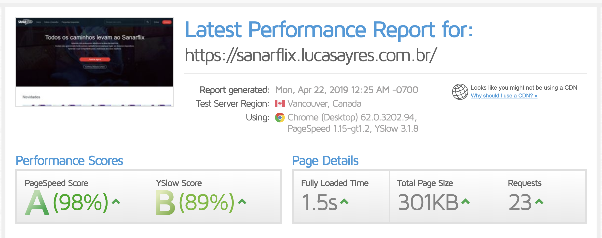

# Desafio Sanar 2019 - Front End

## Features

- next.js
- express
- redux
- reactstrap
- sass
- es6

## Run

```
git clone https://github.com/lucasayres/desafio-sanar.git
cd desafio-sanar
yarn
yarn dev
```

open http://localhost:3000

## Demo

Coloquei em produção em um subdomínio, utilizando Docker e CI/CD do Gitlab.

https://sanarflix.lucasayres.com.br

## Teste de performance

Realizei um teste de performance pelo GTmetrix, segue print do resultado abaixo.



## Observação

1) A rota `https://5b7570f8deca780014ec9f86.mockapi.io/v1/cursos` não estava trazendo as imagens, estava sem permissão, por isso coloquei uma imagem padrão para exibir nos cursos.

2) Não deu tempo para implementar testes, foi a única coisa que ficou faltando.